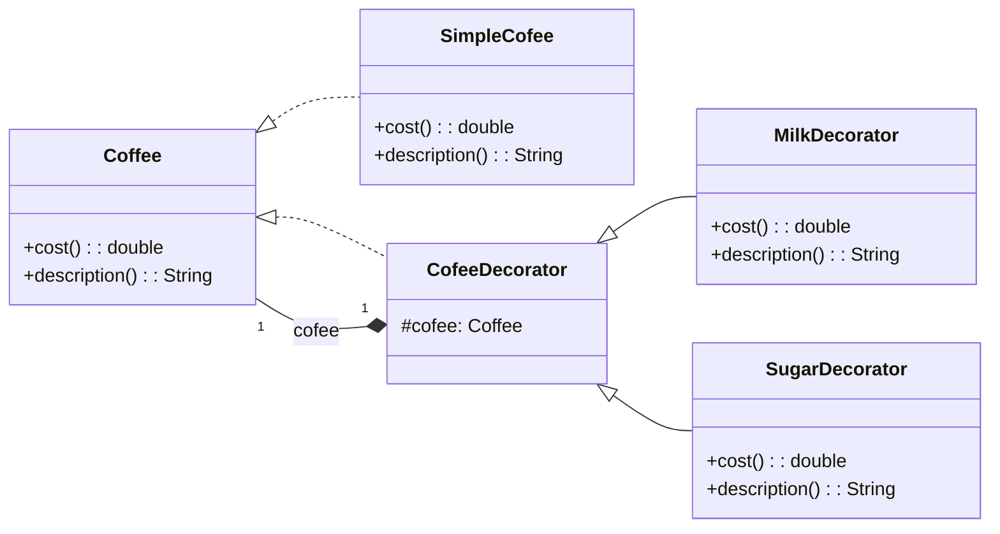

### Real-World Example – Coffee Shop

**Scenario:**

In a coffee shop, a customer can order **simple coffee** or coffee with **extra ingredients** (milk, sugar, whipped cream, etc.).

Each topping adds a **cost** and modifies the **description**.

### Class Diagram

