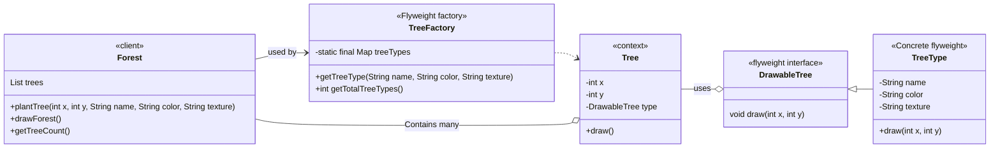

# Introduction of Flyweight Design Pattern

**Definition:**
Flyweight is a structural design pattern that enables sharing common data across multiple objects to reduce memory usage.

**Intent:**
Minimize memory by sharing as much data as possible with similar objects.

**When to Use:**
* You have a large number of similar objects.
* Object creation is resource-intensive.

### Intrinsic State:
* This refers to the data that is shared among multiple objects of the same type.
* It is independent of the object's context and remains constant once initialized.
* Intrinsic state is typically stored within the flyweight object itself and made immutable to ensure consistent sharing.
* Examples include the font style and size of a character in a text editor, or the type and color of a chess piece.

### Extrinsic State:
* This refers to the data that is unique to each object instance and varies with its context.
* It is not stored within the flyweight object but is instead passed to the object dynamically when its operations are invoked.
* Extrinsic state allows flyweight objects to be reused across different contexts by providing the specific contextual information needed for each use case.
* Examples include the position of a character on a screen, or the position of a chess piece on a board.

### Characteristics of the Flyweight Pattern
* **Intrinsic vs. Extrinsic state separation.**
* **Uses a factory or cache to manage shared instances.**
* **Ideal for systems with high object counts (e.g., text editors, game engines).**
* **Reduces memory footprint but increases complexity.**

### Key Components of Flyweight Pattern

| Component | Description |
| :--- | :--- |
| **Flyweight** | Interface for shared objects (e.g., TreeType) |
| **ConcreteFlyweight** | Implements the Flyweight interface and stores intrinsic state |
| **FlyweightFactory** | Creates and manages flyweight objects, ensures sharing (e.g., TreeFactory) |
| **Client** | Uses flyweight objects and provides extrinsic data (e.g., Tree) |

### Key Benefits

| Feature | Without Flyweight | With Flyweight |
| :--- | :--- | :--- |
| **Tree Instances** | 20,000 | 20,000 |
| **TreeType Instances** | 20,000 | 2 |
| **Memory Usage** | Very High | Very Low |
| **Object Sharing** | ❌ | ✅ |
| **Separation of State** | ❌ | ✅ (intrinsic/extrinsic) |

### Advantages of Flyweight Design Pattern

| Advantage | Explanation |
| :--- | :--- |
| **Memory Efficiency** | Reduces memory usage by sharing common (intrinsic) data among many objects. In your example, only 1 `TreeType` is needed for thousands of trees of the same type. |
| **Performance Improvement** | Less memory usage means reduced garbage collection pressure and faster application performance. |
| **Scalability** | Supports systems that need to handle millions of similar objects (e.g., text editors, game objects, document editors). |
| **Decouples State** | Cleanly separates intrinsic (shared) and extrinsic (context-specific) state, improving modularity. |
| **Reusability** | Shared objects (flyweights) are managed centrally and reused - fewer objects means fewer bugs and memory leaks. |

### Disadvantages of Flyweight Design Pattern

| Disadvantage | Explanation |
| :--- | :--- |
| **Increased Complexity** | Introduces extra layers - factory, flyweight interface, and separation of states - which can make the design harder to understand for beginners. |
| **Intrinsic/Extrinsic Confusion** | Developers must manually identify and separate shared (intrinsic) and unique (extrinsic) states correctly, or bugs/memory misuse can occur. |
| **Thread Safety Concerns** | Shared flyweight objects must be used with care in multithreaded applications. |
| **Harder to Debug** | Debugging shared objects used by many parts of the system can be more complex, as changes or issues may have global effects. |
| **Less Flexibility in Behavior** | Since flyweights are shared, you can't easily change their behavior at runtime without affecting all objects using that flyweight. |