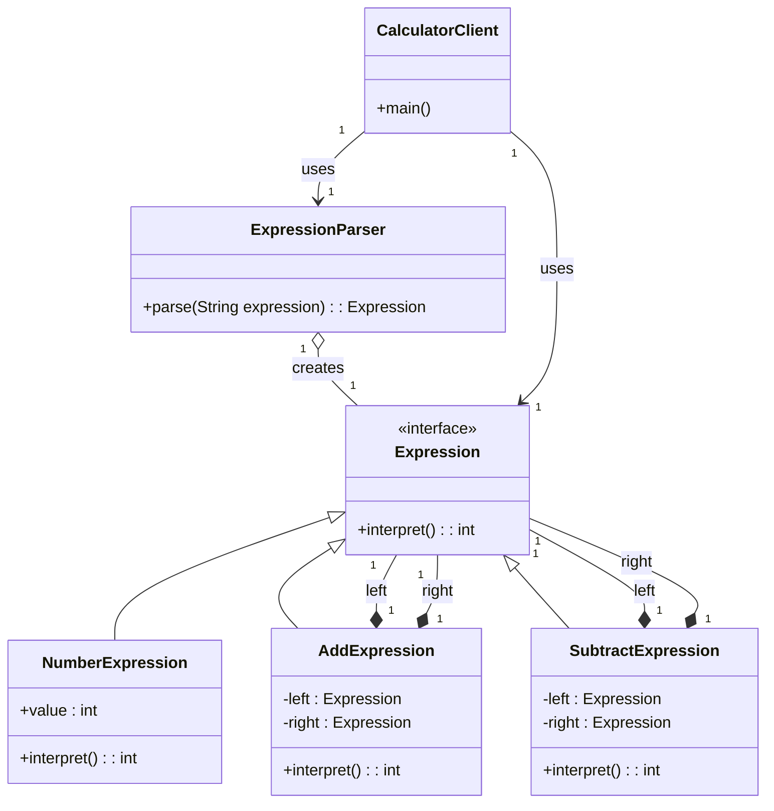

# Interpreter Design Pattern

## Introduction to Interpreter Design Pattern

The Interpreter Design Pattern defines a representation for a language's grammar along with an interpreter that uses the representation to interpret sentences in the language.

It is used to:

* Interpret expressions of a simple language.
* Convert sentences into abstract syntax trees and evaluate them.

### Characteristics of the Interpreter Pattern

* **Defines a grammar for a simple language:** The pattern is best suited for scenarios where you need to parse and interpret sentences of a small, specific language.
* **Includes classes for each grammar rule (Terminal and Nonterminal expressions):** The grammar is represented as a hierarchy of classes. Terminal expressions represent the basic building blocks of the language, while Nonterminal expressions represent combinations of these expressions.
* **Recursively interprets expressions:** The interpretation process typically involves traversing an abstract syntax tree (AST), where each node in the tree corresponds to an expression. The interpretation is performed recursively, starting from the root of the tree.
* **Often used in compilers, query languages, calculators, etc.:** The Interpreter pattern is a classic solution for building components that need to understand and execute commands or expressions written in a specific syntax.
* **Easy to extend with new rules:** Adding new rules to the language simply involves creating new classes that conform to the `Expression` interface, making the grammar highly extensible.

### Key Components of Interpreter Pattern

| Component         | Role                                                                |
| ----------------- | ------------------------------------------------------------------- |
| **Expression** | Abstract interface for interpreting expressions. It defines the `interpret()` method that all concrete expression classes must implement. |
| **Number** | **Terminal Expression**. Represents a basic, non-divisible element of the grammar, such as a number. Its `interpret()` method simply returns its own value. |
| **Add/Subtract** | **Non-terminal Expressions**. Represent more complex grammar rules. They are composed of other `Expression` objects (both terminal and non-terminal). Their `interpret()` method recursively calls the `interpret()` method of their child expressions. |
| **Parser** | Converts the string input (e.g., `"10 - 2 + 4"`) into an expression tree (also known as an Abstract Syntax Tree or AST) composed of `Expression` objects. |
| **Context** | An optional component that stores global information needed during interpretation, such as a list of variables and their values. In a simple calculator, it might not be necessary. |
| **Interpreter/Client** | The client that builds the expression tree using the `Parser` and then initiates the interpretation by calling the `interpret()` method on the root of the tree. |

### Key Components of Interpreter Pattern

| Component | Role |
| :--- | :--- |
| Expression | Abstract interface for interpreting expressions |
| Number | Terminal expression representing a number |
| Add/Subtract | Non-terminal expressions representing grammar rules |
| Parser | Converts string input into expression tree |
| Context | Optional – stores global information needed during interpretation |

### Advantages
- Easy to add new grammar rules.
- Great for small domain-specific languages (DSLs).
- Recursive structure matches grammar naturally.
- Encourages modular class design.

### Disadvantages
- Complex grammars become hard to manage.
- Many small classes can clutter code.
- Inefficient for performance-critical parsing.
- Difficult to use for full programming languages.