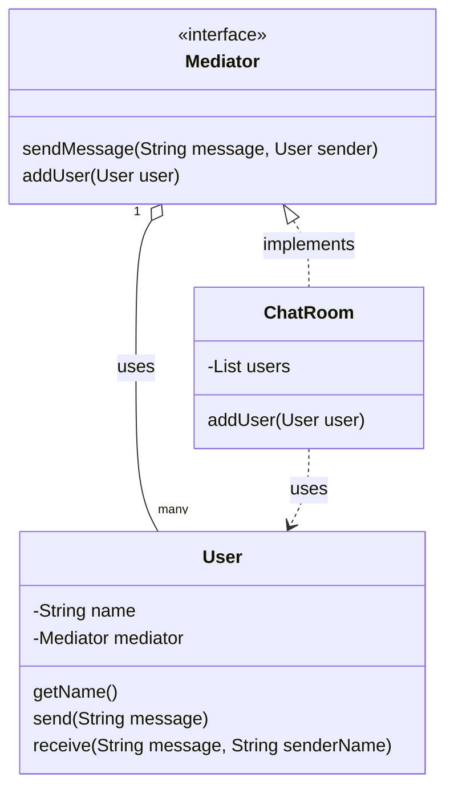

# Introduction of Mediator Design Pattern

The Mediator Pattern is a **behavioral design pattern** that defines an object (Mediator) to encapsulate how a set of objects interact. It promotes loose coupling by preventing objects from referring to each other explicitly, and it lets you alter their interaction independently.

# Characteristics of Mediator Design Pattern

* Centralized communication between components.
* Reduces direct dependencies (tight coupling) between components.
* Makes code more maintainable and flexible.
* Easy to add new colleagues or modify communication logic.
* Components (Colleagues) talk to the Mediator, not to each other.

# Key Components of Mediator Pattern

| Component | Role |
| :--- | :--- |
| **Mediator** | Interface for communication between components. |
| **ConcreteMediator** | Implements the communication logic and holds references to components. |
| **Colleagues** | Colleague interface are the components or objects that interact with each other. They communicate through the Mediator, and each colleague class is only aware of the mediator, not the other colleagues. |
| **ConcreteColleagues** | Concrete Colleague classes are the specific implementations of the Colleague interface. They rely on the Mediator to communicate with other colleagues, avoiding direct dependencies and promoting a more flexible and maintainable system architecture. |

### Advantages:

* Promotes **loose coupling** between colleagues.
* **Centralized control** for communication.
* Enhances **maintainability** and **scalability**.
* Communication logic is isolated in one place (the Mediator).

### Disadvantages:

* Mediator can become **complex** as more colleagues are added.
* Might introduce a **performance bottleneck** in large systems.
* **Over-centralization** may reduce flexibility.